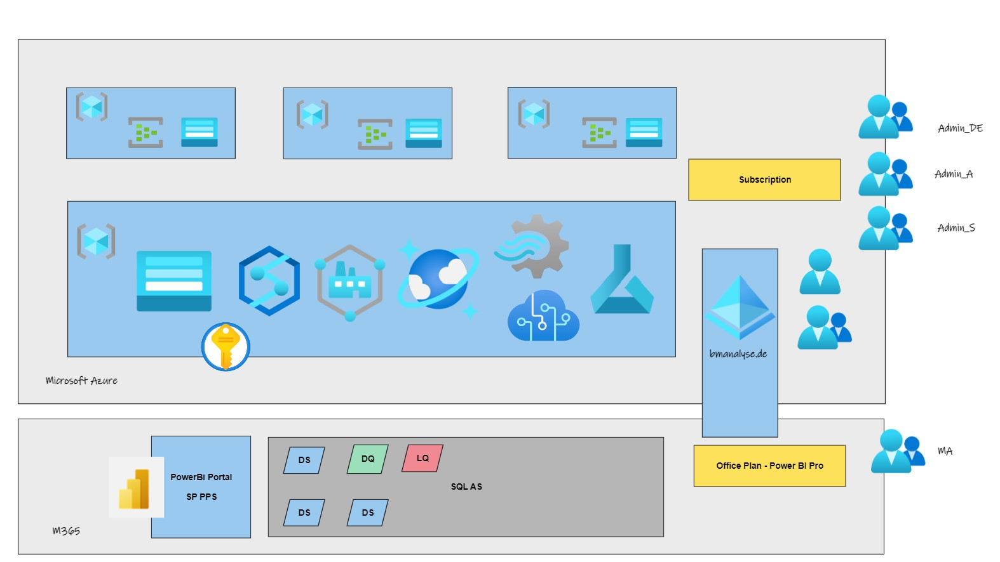

---
WS:
    title: 'Workshop Data AI'
    coach: 'Michael Lindner'
---

# Übungsthema "Zeitmesser (TimeKeeper)"

In diesem Workshop werden die Datenerfassung, Verarbeitung und Auswertung im gesamten Azure und M365 Umfeld geübt.

## Schwerpunkte

- Einrichten der Azure und M365 Umgebung
- Aufbau eines Datenanalyse Szenarios
- Umsetzung des Szenarios

## Erfassungsbereiche

Folgende Darstellung zeigt das grobe Projektumfeld

## Überblick: Die Arbeitsumgebung

Im folgenden Abbild sehen Sie die Umgebung in der wir uns im Workshop bewegen.

## Prozesse der Umgebung

1. Erhebung der Daten auf Zeitmesscomputern
2. Versenden der Daten (Realtime Stream)
3. Einlesen vorhandener Daten
4. Verarbeiten der Daten
5. Langzeitspeicherung
6. Sicherung / Absicherung
7. Wiederverwendung (Prüfung gemeldeter Daten)
8. Berichte

## Prozessplanung

1. Feststellen der beteiligten Rollen
> Die ermittelten Rollen werden in Sicherheitsgruppen überführt
 
> Die AAD (zentraler Identitätsprovider) hat den Vorteil das Datenquelle, Verarbeitung und Datensicht zentral abgesichert werden können

1.1. Geamtprozessadministrator
1.2. Datenadministrator
1.3. Analyseadministrator
1.4. Berichtsleser (Mitarbeiter)
3. Feststellen der benötigten Ausgaben
4. Feststellen der benötigten Eingaben
5. Feststellen der benötigten Verarbeitungsschritte
6. Feststellen der benötigten Technologien

## Umsetzung

### technische Umsetzung

1. Azure Subscription (cloud)
   - Azure Active Directory
2. M365 Subscription (PowerBi) (cloud)
3. Computer private (Windows/Linux) Messdatenerfassung

### Nutzerrollen

1. Pro
