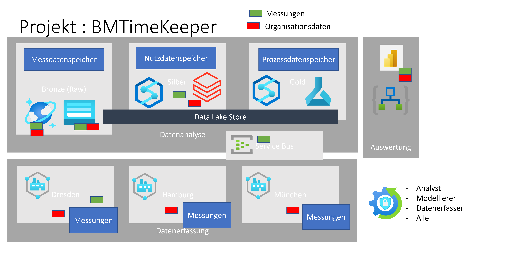
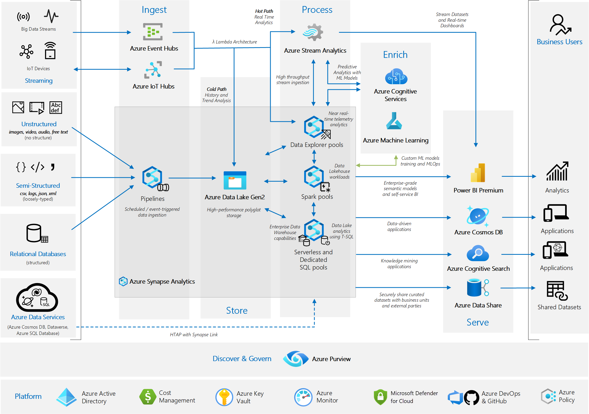

---
WS:
    title: 'Workshop Data AI'
    coach: 'Michael Lindner'
---

# Übungsthema "Zeitmesser (TimeKeeper)"

In diesem Workshop werden die Datenerfassung, Verarbeitung und Auswertung im gesamten Azure und M365 Umfeld geübt.

## Schwerpunkte

- Einrichten der Azure und M365 Umgebung
- Aufbau eines Datenanalyse Szenarios
- Umsetzung des Szenarios

## Erfassungsbereiche

Folgende Darstellung zeigt das grobe Projektumfeld

## Überblick: Die Arbeitsumgebung

Im folgenden Abbild sehen Sie die Umgebung in der wir uns im Workshop bewegen.

## Prozesse der Umgebung

1. Erhebung der Daten auf Zeitmesscomputern
2. Versenden der Daten (Realtime Stream)
3. Einlesen vorhandener Daten
4. Verarbeiten der Daten
5. Langzeitspeicherung
6. Sicherung / Absicherung
7. Wiederverwendung (Prüfung gemeldeter Daten)
8. Berichte

## Prozessplanung

1. Feststellen der beteiligten Rollen
2. Feststellen der benötigten Ausgaben
3. Feststellen der benötigten Eingaben
4. Feststellen der benötigten Verarbeitungsschritte
5. Feststellen der benötigten Technologien

## Umsetzung

### technische Umsetzung

1. Azure Subscription (cloud)
   + Azure Active Directory
2. M365 Subscription (PowerBi) (cloud)
3. Computer private (Windows/Linux) Messdatenerfassung
